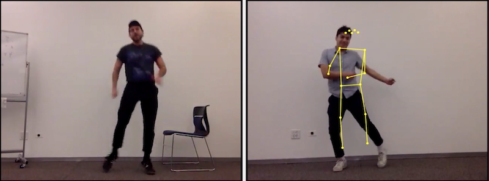

# Coreo

### a choreography assistance tool based on machine learning

Coreo uses TensorFlow's PoseNet pose estimation library, web workers, and video.js / videojs-record to provide immediate video feedback.

### [View our talk](https://www.youtube.com/watch?v=FbEfbmgOsj8)

### Live demo: [http://coreo-ai.herokuapp.com/](http://coreo-ai.herokuapp.com/)

## Installation

- Fork or clone [our repo](https://github.com/brain-dance/brain-dancer) to your local machine.
- `cd` into your folder and run `npm install`
- run `npm run start-dev` to see it in action!
  - If you want to run the server side processing of vieo frames, you'll need to have ffmpeg: `brew install ffmpeg`

## Documentation

Check out [our wiki](https://github.com/brain-dance/brain-dancer/wiki)!

## Team

Coreo AI is created by...

- [Robert Bacon](https://github.com/rb982)
- [Jennie Myhren](https://github.com/jennie-myhren)
- [Dante Tobar](https://github.com/tuna-melt)
- [Jasmine Wang](https://github.com/jsmney)

## Thank you

Big thanks to the following wonderful people!

- [Natalie Estrada](https://github.com/nmestrada)
- [Finn Terdal](https://github.com/fterdal)
- [Collin Miller](https://github.com/collin)
- [Priti Patel](https://github.com/pdpatel2)
- [Travis Stratton](https://github.com/tstrat)
- The 1909 cohort at Fullstack Academy Chicago
